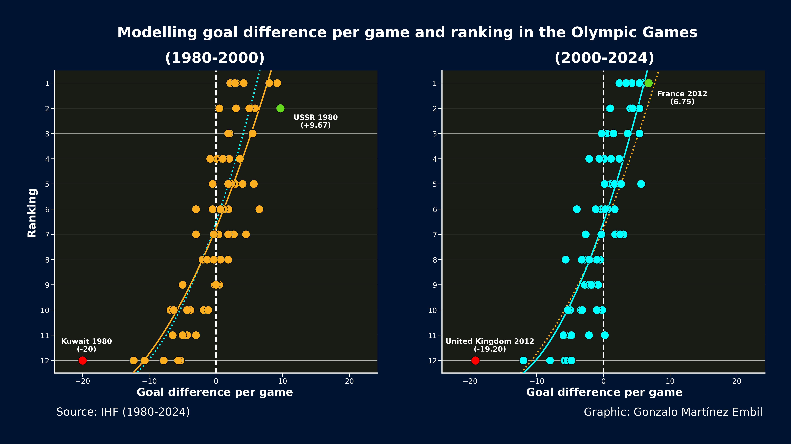
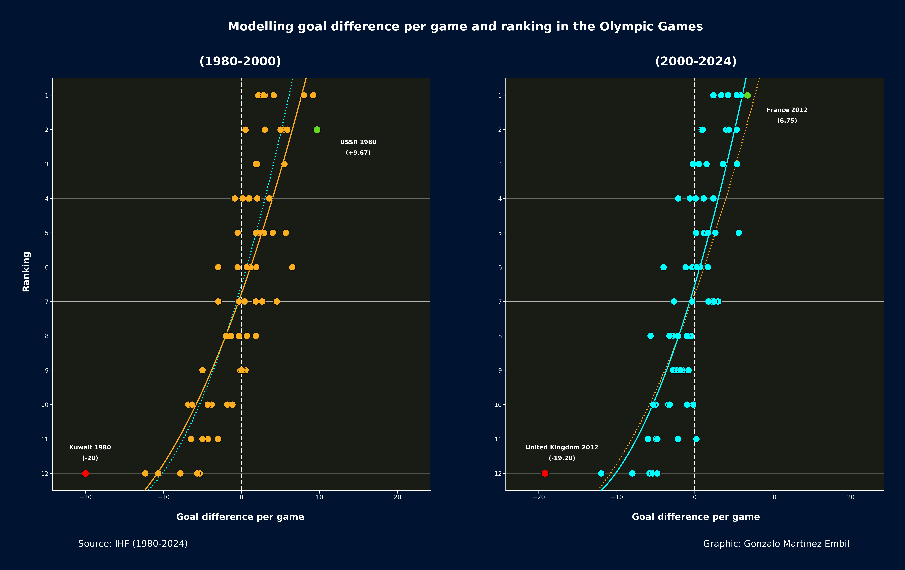

# Analysis of handball evolution at the Olympic Games between 1980 and 2024

In this repository you will find scripts and datasets that allow us to analyze different aspects of handball evolution on the Olympic Game between 1980 and 2024.

This work is a small part of my article "Analysis of handball evolution on the Olympic Games between 1980 and 2024" that you can find on:

*

## Goals per game

.png)

## Goals per team

.png)

## Modelling goal difference per game and ranking

.png)

