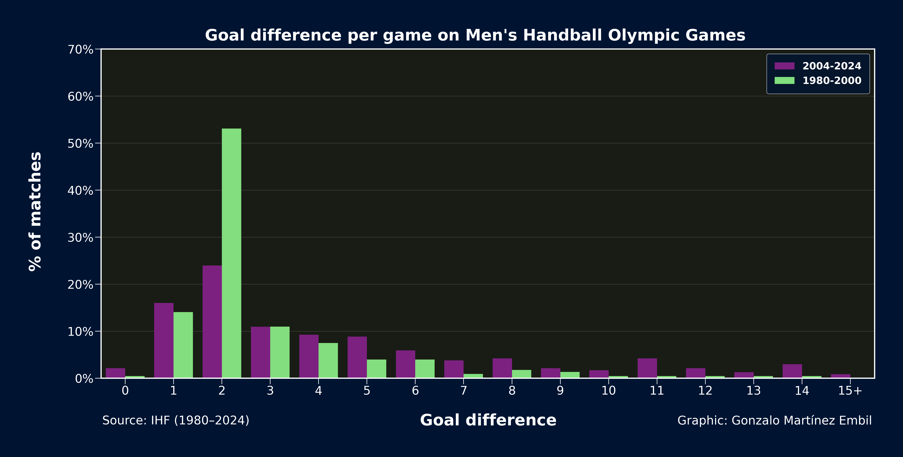

# Analysis of Inequality Evolution in Handball

This repository provides scripts and datasets to analyze handball’s evolution and inequality trends in the Olympic Games from 1980 to 2024.

You can read the full article on:

* https://handballytics.de/inequality-evolution-how-rule-changes-changed-scoring-in-handball/

## Goals per game

.png)

## Goals per team

.png)

## Goal difference per game

## Modelling goal difference per game and ranking

.png)

